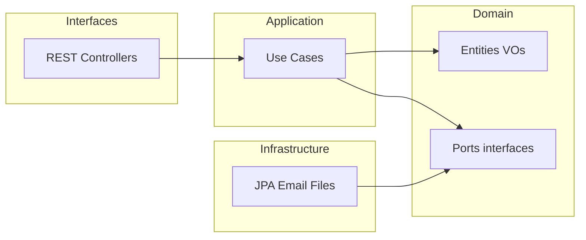

# Skill: Architecture Expert (Clean Architecture)

**Ámbito:** regla de dependencia, capas, inversión de dependencias, convenciones de código y pruebas por capa.  
**Fuente de verdad del stack:** ver tabla canónica en [`AGENT.md`](../AGENT.md) (no duplicar versiones aquí).

---

## Activación (keywords)

Carga este skill cuando el prompt mencione o implique: `capa`, `package`, `clean architecture`, `hexagonal`, `puerto`, `adaptador`, `DTO`, `mapper`, `use case`, `caso de uso`, `naming`, `convención`, `dependencia`, `domain`, `application`, `infrastructure`, `interfaces`, `refactor estructural`.

---

## Regla de dependencia (no negociable)

Las dependencias solo apuntan **hacia dentro**: el dominio no conoce frameworks ni infraestructura.



- **`domain`:** entidades de negocio, value objects, **puertos** (interfaces). Sin Spring, sin JPA, sin HTTP.
- **`application`:** casos de uso, orquestación, políticas de aplicación. Sin adaptadores concretos (solo interfaces del dominio).
- **`infrastructure`:** implementaciones de puertos (JPA, Flyway, clientes externos, colas, almacenamiento).
- **`interfaces` (o `web`):** controladores REST, validación de entrada a nivel API, mapeo a DTOs públicos, manejo de errores HTTP.

**Prohibido:** que `domain` o `application` dependan de módulos de `infrastructure` o `interfaces`.

---

## Estructura de paquetes sugerida

```
com.example.tickets
├── domain
├── application
├── infrastructure
└── interfaces
```

Ajusta el prefijo `com.example.tickets` al groupId real del proyecto cuando exista `pom.xml` (HITL si cambia el contrato de paquetes).

---

## Convenciones de nombres y sufijos

| Artefacto | Convención | Ejemplo |
|-------------|------------|---------|
| Caso de uso | verbo + sustantivo + `UseCase` | `CreateTicketUseCase` |
| Puerto (repositorio) | sustantivo + `Repository` (en domain) | `TicketRepository` |
| Implementación JPA | `Jpa` + nombre del puerto | `JpaTicketRepository` |
| DTO API entrada | `*Request` o `*Command` | `CreateTicketRequest` |
| DTO API salida | `*Response` o `*Query` | `TicketResponse` |
| Mapper | `*Mapper` | `TicketMapper` (MapStruct u otro: **confirmar en HITL**) |
| Excepción de dominio | `*DomainException` o tipo base acordado | `TicketNotFoundDomainException` |
| Controlador REST | `*Controller` | `TicketController` |
| Orquestación en app | preferir `*UseCase` explícito; `*Service` solo si encapsula varios use cases y queda acordado | `TicketApplicationService` |

---

## Inversión de dependencias

- Los **puertos** viven en `domain` (o en un subpaquete `domain.port` si se prefiere).
- Spring **solo** cablea implementaciones en `infrastructure` (clases `@Configuration` que registran beans).
- Preferir constructor injection; evitar `@Autowired` en campos en código nuevo.

---

## Inmutabilidad y modelos

- DTOs de API y value objects: preferir `record` cuando no se requiera herencia.
- Agregados con identidad: mutación controlada por métodos de dominio, no setters públicos masivos.

---

## Multiplataforma y soberanía (contexto arquitectónico)

- `domain` y `application` no deben acoplarse a APIs de SO, rutas locales fijas ni detalles de despliegue.
- Decisiones de residencia de datos (región, cifrado, tenant) se reflejan en puertos y políticas; la implementación vive en `infrastructure` y en el skill **db-expert** / **security-expert** según aplique.

---

## Testing por capa

| Capa | Enfoque |
|------|---------|
| `domain` | JUnit sin Spring |
| `application` | Tests con mocks de puertos |
| `infrastructure` | `@DataJpaTest`, Testcontainers según necesidad |
| `interfaces` | `@WebMvcTest` o slice equivalente |

---

## Human in the Loop (HITL) — gates

Requiere **aprobación explícita** de un humano antes de ejecutar o mergear:

- Introducir una **nueva capa** o renombrar capas existentes.
- Mover tipos entre paquetes que crucen la regla de dependencia.
- Añadir **cualquier dependencia** nueva en `domain` o `application` (incl. librerías de terceros).
- Exponer entidades de dominio o JPA en la API pública.
- Consolidar lógica de negocio en controladores o repositorios (debe revertirse o rediseñarse con HITL).

---

## Anti-patrones

- Entidades JPA como contrato de API REST.
- Casos de uso que importan clases de `infrastructure`.
- Lógica de negocio en `@Controller` o en queries ad-hoc del repositorio sin pasar por el modelo de dominio.
- “God services” sin límites claros de responsabilidad.

---

## Relación con otros skills

- Persistencia y migraciones: [`.skills/db-expert.md`](db-expert.md)
- Autenticación, JWT, BCrypt: [`.skills/security-expert.md`](security-expert.md) — las **invariantes globales** están en [`AGENT.md`](../AGENT.md).
