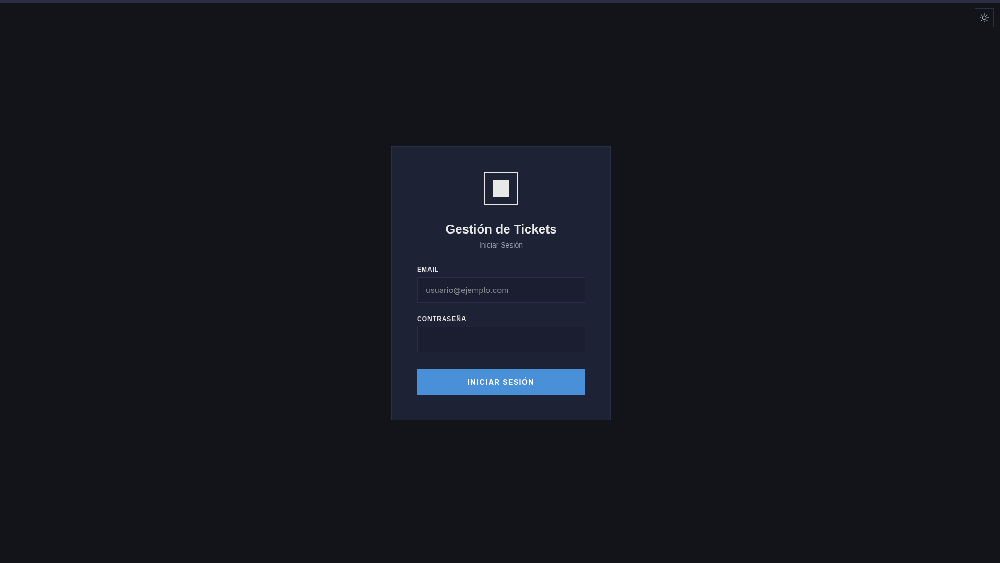
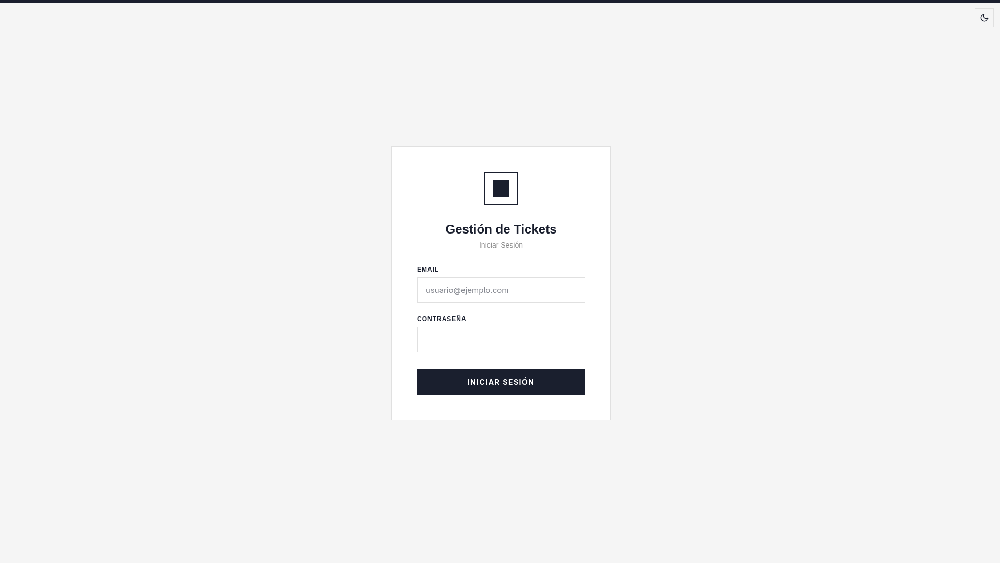
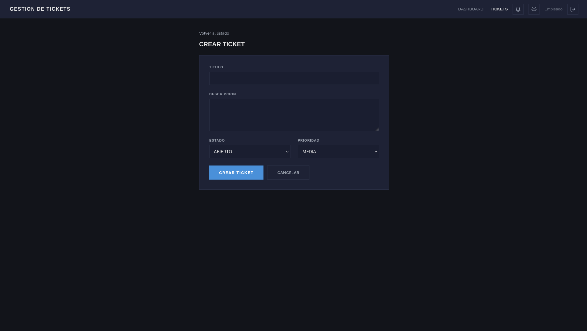
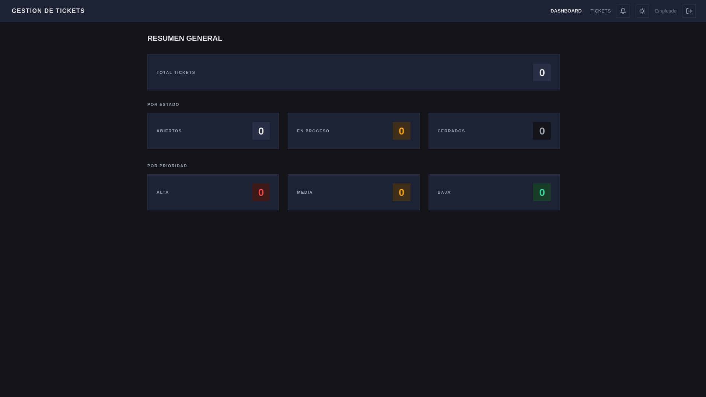
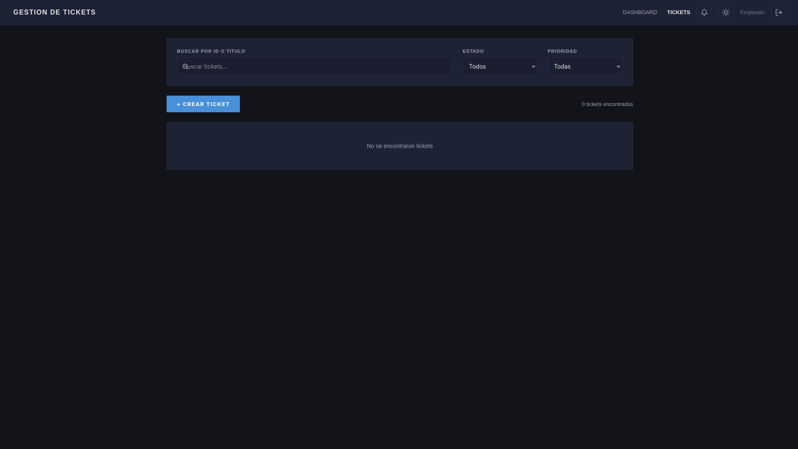

# Tickets Backend — Sistema de Gestion de Incidencias

Aplicacion web para la gestion centralizada de tickets e incidencias empresariales, con soporte offline, notificaciones en tiempo real, roles de usuario y dashboard de estadisticas.

## Estado del Proyecto

**MVP completo.** Todas las funcionalidades planificadas han sido implementadas y verificadas.

| Funcionalidad | Estado |
|---|---|
| Login / Registro / JWT | ✅ |
| CRUD tickets | ✅ |
| Listado con busqueda y filtros | ✅ |
| Detalle con comentarios y adjuntos | ✅ |
| Cambio de estado ciclico | ✅ |
| Asignar tecnico | ✅ |
| Notificaciones | ✅ |
| Dashboard de estadisticas | ✅ |
| Paginacion | ✅ |
| Perfil de usuario | ✅ |
| Roles (ADMIN/USER) | ✅ |
| Modo offline | ✅ |

## Previsualizacion

### Login Dark Mode


### Login White Mode


### Crear Tickets


### Dashboard


### Lista de Tickets


## Inicio Rapido

```bash
# 1. Base de datos
docker-compose up -d

# 2. Backend
mvn spring-boot:run

# 3. Frontend
cd frontend && npm install && npm run dev
```

- Frontend: `http://localhost:3000`
- Backend API: `http://localhost:8080`
- Primer usuario registrado = **ADMIN**, resto = **USER**

## Stack Tecnologico

| Tecnologia | Version |
|---|---|
| Java | 25 |
| Spring Boot | 3.2.5 |
| PostgreSQL | 16 |
| React | 18 |
| TypeScript | 5 |
| Vite | 5 |

## Documentacion

- **AGENT.md** — Guia para agentes AI: estructura, API routes, invariantes de seguridad, modo offline, roles
- **PROJECT.md** — Documentacion completa del proyecto para lectura humana
- **.skills/** — Skills especializados (architecture, database, security, frontend)

## Modo Offline

La app funciona sin conexion gracias a:
- **Service Worker** cachea assets y respuestas API
- **IndexedDB** almacena tickets y cola de operaciones pendientes
- Al reconectar, sincroniza automaticamente y refresca datos

## Roles

| Rol | Permisos |
|---|---|
| ADMIN | Eliminar tickets, asignar tecnicos, ver lista de usuarios |
| USER | Crear tickets, comentar, cambiar estado |
